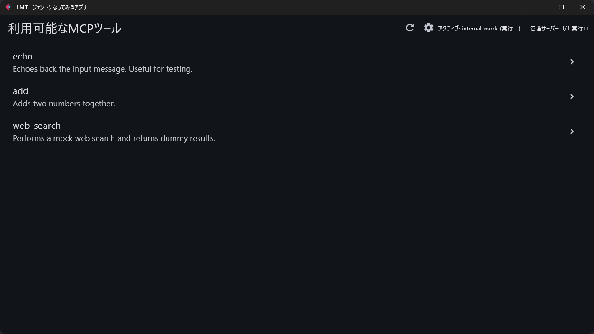

# LLMエージェントになってみるアプリ

LLMエージェントになりきって、MCPサーバーから取得したツールを**自力で**使うことができます。

> [!WARNING]
> ネタアプリです。



## 利用方法

- `config.json`を作成する。(`config.json.sample`を参考。)
- 次のように環境を作成してから、Fletアプリを立ち上げる。

```bash
uv sync
uv run main.py
```

## 余談

- Geminiに半分くらい作ってもらいました。Windows環境ではサブプロセス+パイプが動かないエラー[^1]をGeminiでは修正できず、代わりにMCP SDKでの実装に自力で直しました。修正できていないエラーが残っていますが、とりあえず動くので目を瞑りました。
- 内部で自動的に立つサーバー(`mcp_server_mock.py`)と外部のサーバーとは`sse`で接続します。外部のサーバーの例として`mcp_server/weather.py`が使えます。
- それ以外のMCPサーバーとは`stdio`で接続します。設定方法は他のMCPクライアントとほぼ同じで、`config.json`に書きます。

[^1]: [Windowsでのサポート](https://docs.python.org/ja/3.6/library/asyncio-eventloops.html#windows)に関連?
